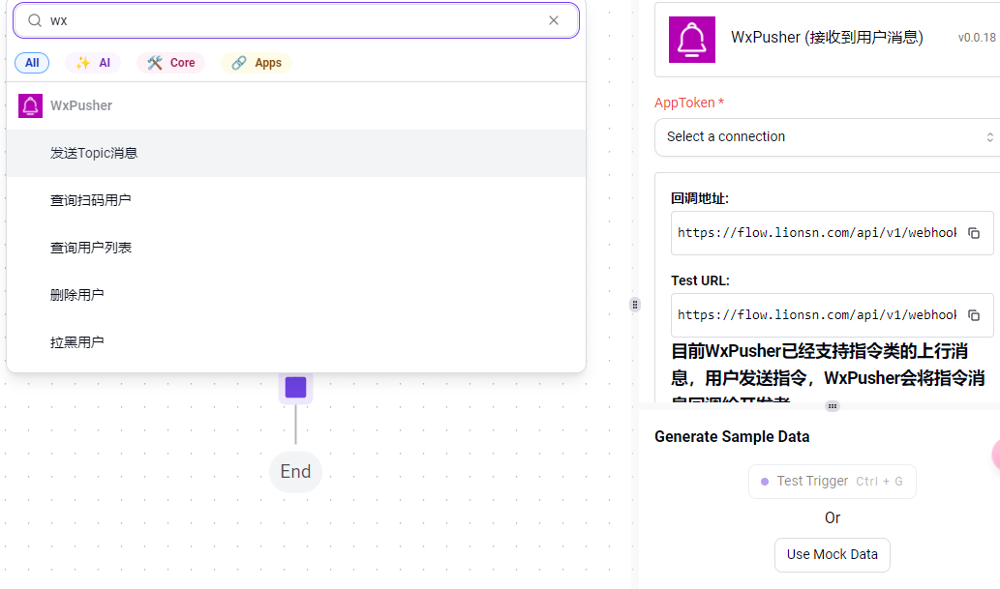

# activepieces国内适配计划： WxPusher支持

## 什么是WxPusher
> WxPusher (微信推送服务)是一个使用微信公众号作为通道的，实时信息推送平台，你可以通过调用API的方式，把信息推送到微信上，无需安装额外的软件，即可做到信息实时通知。 你可以使用WxPusher来做服务器报警通知、抢课通知、抢票通知，信息更新提示

## 如何使用WxPusher

[如何使用WxPusher](https://wxpusher.zjiecode.com/docs/#/)

## 管理后台：

[WxPusher管理后台](https://wxpusher.zjiecode.com/admin/main)

## 支持：

功能：
- [x] 查询扫码用户
- [x] topic/user 发送消息
- [x] 用户列表获取
- [x] 拉黑、删除用户

触发器：
- [x] 接收用户消息

## 更新：
- 2024-10-21：
  - 新增：发送消息渲染类型，订阅类型选项
  - 新增：拉黑、删除用户
  
  
  